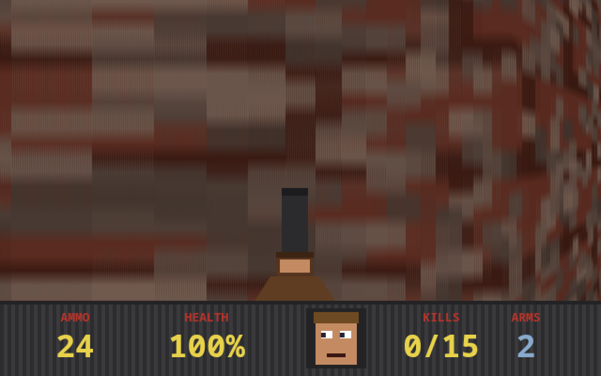
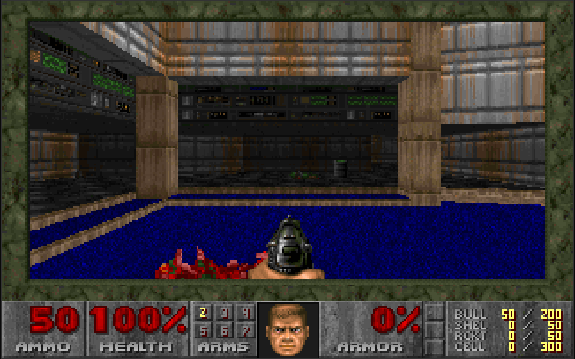

# DoomJS

DOOM in the browser, two ways:

| | |
|---|---|
| **[/ (root)](index.html)** — a from-scratch DOOM-style FPS in pure HTML/CSS/JS. No libraries, no assets, no build step: raycast renderer, procedural textures & sprites, WebAudio-synthesized sound. | **[/wasm](wasm/index.html)** — the *actual* id Software DOOM engine (linuxdoom-1.10, GPL source) compiled to WebAssembly with Emscripten, running the shareware episode. |
|  |  |

## Play

Any static server works — there's nothing to build:

```sh
python3 -m http.server
# remake:      http://localhost:8000/
# real engine: http://localhost:8000/wasm/
```

### Controls

| | JS remake | WASM original |
|---|---|---|
| Move | WASD | Arrow keys |
| Turn | Mouse (click to lock) or arrows | Arrow keys |
| Fire | Click / Ctrl | Ctrl |
| Use / open | E or Space | Space |
| Run | — | Shift |
| Weapons | — | 1–4 |
| Map | — | Tab |
| Menu | — | Esc |

## The JS remake (root)

Three files: `index.html`, `style.css`, `game.js`. Everything is generated at
load time — wall textures, demon sprites, the HUD face, pickups are drawn onto
offscreen canvases, and all sound effects are synthesized with WebAudio.
Fight 15 demons through a 24×24 map and reach the glowing exit.

## The WASM build (`/wasm`)

id released the DOOM engine source in 1997 (later under the GPL). `src/linuxdoom-1.10`
in this repo is that source with only the machine-specific layer swapped for
browser equivalents — the renderer, game logic, and WAD loading are untouched:

- `i_video.c` — X11 → HTML canvas + browser keyboard events
- `i_sound.c` — silent stub (the original wrote to `/dev/dsp`)
- `i_net.c` — single-player stub
- `d_main.c` — game loop driven by the browser at the native 35 fps
- small fixes for modern compilers (`values.h` shim, a `strupr` clash)

Game data is the freely-distributable **shareware** `doom1.wad` (Episode 1),
packed into `wasm/index.data`.

### Rebuild from source

```sh
git clone https://github.com/emscripten-core/emsdk && cd emsdk
./emsdk install latest && ./emsdk activate latest && source emsdk_env.sh
cd ../src/linuxdoom-1.10
emcc *.c -o ../../wasm/index.html -std=gnu89 -O2 -I. -DNORMALUNIX -DLINUX \
  -Wno-everything -sINITIAL_MEMORY=134217728 -sNO_EXIT_RUNTIME=1 \
  --preload-file doom1.wad --shell-file ../shell.html
```

(drop a `doom1.wad` into `src/linuxdoom-1.10` first — the shareware WAD is easy to find)

## License

- The JS remake is original code, MIT.
- `src/` is id Software's DOOM source, distributed under its license
  (see `src/LICENSE.TXT`); id later re-released the source under the GPL.
- `doom1.wad` is the shareware episode, which id allowed to be freely copied.

DOOM is a trademark of id Software. This is a fan/educational project.
